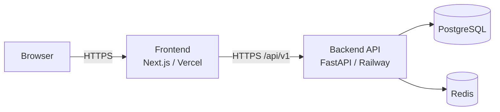
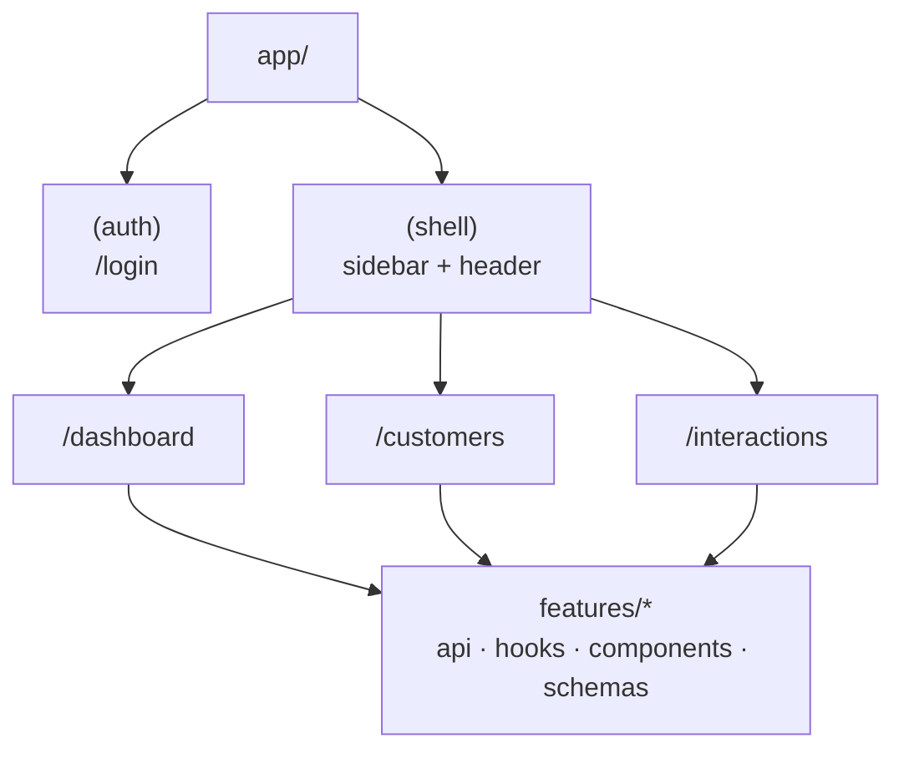
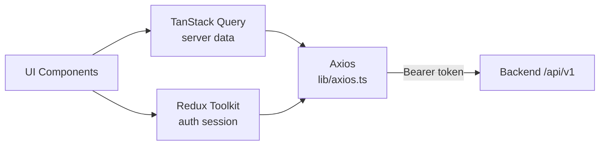
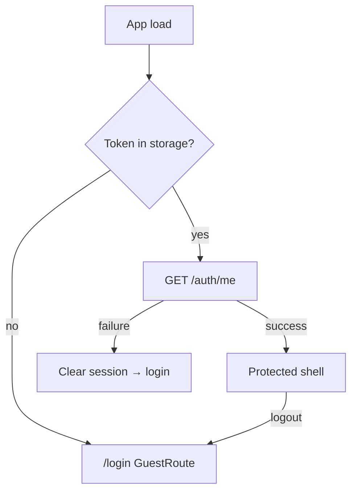

# Deterministic Insights
### Customer Success Insights · Frontend

**Deterministic Insights** is an AI-powered Customer Success platform. CS and account teams manage their customer book, log meetings and other interactions, turn raw notes into structured AI insights (summary, sentiment, action items, and risks), and track portfolio health on a live dashboard.

This repository is the **Next.js frontend** — the web UI for login, dashboard, customers, interactions, and insight generation against the FastAPI backend.


|               |                                                 |
| ------------- | ----------------------------------------------- |
| Framework     | Next.js 15 (App Router) · React 19 · TypeScript |
| Styling       | Tailwind CSS · shadcn/ui                        |
| Server state  | TanStack Query                                  |
| Session state | Redux Toolkit                                   |
| HTTP          | Axios                                           |
| Forms         | React Hook Form · Zod                           |


Companion API: [Backend (Railway)](https://deterministicinsightsbackend-production.up.railway.app/) · [Swagger](https://deterministicinsightsbackend-production.up.railway.app/api/v1/docs) · [Backend repository](https://github.com/Prayag-Sheth/deterministic_insights_backend.git)

---


## Live deployment


| Resource                      | URL                                                                                                                                                      |
| ----------------------------- | -------------------------------------------------------------------------------------------------------------------------------------------------------- |
| Frontend application (Vercel) | [https://deterministic-insights-frontend.vercel.app/](https://deterministic-insights-frontend.vercel.app/)                                               |
| Frontend Git repository       | [https://github.com/Prayag-Sheth/deterministic_insights_frontend.git](https://github.com/Prayag-Sheth/deterministic_insights_frontend.git)               |
| Backend API (Railway)         | [https://deterministicinsightsbackend-production.up.railway.app/](https://deterministicinsightsbackend-production.up.railway.app/)                       |
| Backend Swagger docs          | [https://deterministicinsightsbackend-production.up.railway.app/api/v1/docs](https://deterministicinsightsbackend-production.up.railway.app/api/v1/docs) |
| Demonstration video & docs    | [https://drive.google.com/drive/folders/18coawqzqt6UIO_CGoFncnIa5TIxHgMqn](https://drive.google.com/drive/folders/18coawqzqt6UIO_CGoFncnIa5TIxHgMqn)     |


This repository is the **frontend** deployable. The API is a separate GitHub repository hosted on Railway. For local full-stack work, a parent workspace may run both packages with shared Compose for Postgres/Redis/API.

---


## Table of contents

1. [Live deployment](#live-deployment)
2. [Architecture](#architecture)
3. [Prerequisites](#prerequisites)
4. [Quick start](#quick-start)
5. [Environment variables](#environment-variables)
6. [Demo credentials](#demo-credentials)
7. [Scripts](#scripts)
8. [Project structure](#project-structure)
9. [Implementation notes](#implementation-notes)
10. [Backend dependency](#backend-dependency)
11. [Production notes](#production-notes)

---


## Architecture


### System context




### Application structure




### Client data flow




### Auth navigation




---


## Prerequisites

- Node.js **20+** (LTS recommended)
- Backend API reachable at the URL configured in `.env.local`

Local default: `http://localhost:8000/api/v1`  
Production default target: `https://deterministicinsightsbackend-production.up.railway.app/api/v1`

---


## Quick start

```bash
cd frontend
npm install
cp .env.local.example .env.local
# PowerShell: Copy-Item .env.local.example .env.local

npm run dev
```

Open [http://localhost:3000](http://localhost:3000) and sign in with the [demo credentials](#demo-credentials).

Production build locally:

```bash
npm run build
npm start
```

---


## Environment variables

Copy from `[.env.local.example](./.env.local.example)`.


| Variable                                  | Default                        | Description                                 |
| ----------------------------------------- | ------------------------------ | ------------------------------------------- |
| `NEXT_PUBLIC_API_BASE_URL`                | `http://localhost:8000/api/v1` | Axios base URL — **must include** `/api/v1` |
| `NEXT_PUBLIC_INSIGHT_GENERATE_TIMEOUT_MS` | `120000`                       | Timeout for insight generation only         |


`NEXT_PUBLIC_*` values are embedded in the browser bundle. Never put secrets there.

For Vercel production, set `NEXT_PUBLIC_API_BASE_URL` to the Railway API `/api/v1` base and redeploy.

---


## Demo credentials

These are **demo seed accounts** for local and live app review only — not infrastructure secrets.


| Role   | Email               | Password    | Access                                           |
| ------ | ------------------- | ----------- | ------------------------------------------------ |
| Admin  | `admin@example.com` | `Admin111@` | All customers, owner filters, reassign ownership |
| Member | `user@example.com`  | `User111@`  | Own customers and related interactions only      |


Use these on the live app: [https://deterministic-insights-frontend.vercel.app/login](https://deterministic-insights-frontend.vercel.app/login)

> Admin credentials are configured via `ADMIN_*` environment variables before the first seed. See `backend/.env.example` for variable names — do not commit real credentials to version control.

---


## Scripts


| Command                | Purpose                        |
| ---------------------- | ------------------------------ |
| `npm run dev`          | Development server (Turbopack) |
| `npm run build`        | Production build               |
| `npm start`            | Serve production build         |
| `npm run lint`         | ESLint                         |
| `npm run format`       | Prettier write                 |
| `npm run format:check` | Prettier check                 |


---


## Project structure

```
frontend/
├── app/
│   ├── (auth)/login/           # Guest login
│   └── (shell)/                # Authenticated chrome
│       ├── dashboard/
│       ├── customers/
│       └── interactions/
├── features/
│   ├── auth/                   # Session, guards, login form
│   ├── customers/              # CRUD, filters, owner reassignment
│   ├── interactions/           # CRUD, filters, detail
│   ├── insights/               # Insight card, generate action
│   ├── dashboard/              # KPIs and widgets
│   └── users/                  # User list (admin picker)
├── components/
│   ├── layout/                 # Shell, sidebar, header
│   ├── shared/                 # Table, empty/error/loading
│   └── ui/                     # shadcn primitives
├── lib/                        # Axios, auth helpers, utils
├── store/                      # Redux auth slice
└── types/                      # Shared TypeScript types
```


### Feature map


| Feature        | Responsibility                                       |
| -------------- | ---------------------------------------------------- |
| `auth`         | Login, session hydrate, protected/guest routes       |
| `customers`    | List/filters/forms, delete, admin owner reassignment |
| `interactions` | List/filters/forms, detail with notes                |
| `insights`     | Status badges, generate button, result panels        |
| `dashboard`    | Overview metrics, sentiment, recent activity         |
| `users`        | Users for admin owner selection                      |


---


## Implementation notes


### Auth UX

- `SessionLoader` restores session from stored token + `GET /auth/me`
- `ProtectedRoute` gates shell pages; `GuestRoute` redirects authenticated users away from login
- No self-service registration UI (backend register exists for API use)
- Access token only — expiry clears session and returns to login


### Data and forms

- TanStack Query owns server resources; Redux owns auth session
- Zod schemas + React Hook Form mirror backend validation expectations
- Mutations invalidate related query keys after success
- List UIs use shared table/empty/error/loading patterns


### Insight generation

- Generate calls `POST /interactions/{id}/generate-insight`
- Uses `NEXT_PUBLIC_INSIGHT_GENERATE_TIMEOUT_MS` (default 120s) so LLM latency does not hit the global Axios timeout
- Single request/response UX — no SSE and no background polling while `pending`


### Access expectations

- Members only see their data; cross-owner resources appear as not found (API **404**)
- Admins see global lists and reassign-owner actions on customer detail

---


## Backend dependency

1. Ensure the API is healthy (`/health` locally or on Railway).
2. Point `NEXT_PUBLIC_API_BASE_URL` at `{apiOrigin}/api/v1`.
3. Ensure backend `CORS_ORIGINS` includes the UI origin (`http://localhost:3000` or the Vercel domain).

Login encoding (OAuth2 form body) is handled by the frontend auth client.


| Environment | Typical API base                                                        |
| ----------- | ----------------------------------------------------------------------- |
| Local       | `http://localhost:8000/api/v1`                                          |
| Production  | `https://deterministicinsightsbackend-production.up.railway.app/api/v1` |


---


## Production notes

- [ ] Set `NEXT_PUBLIC_API_BASE_URL` to the Railway `/api/v1` URL **before** build/deploy
- [ ] Confirm backend CORS allows the Vercel origin
- [ ] Never store JWT secrets or DB credentials in frontend env
- [ ] Prefer HTTPS end-to-end (Vercel + Railway)

**Live app:** [https://deterministic-insights-frontend.vercel.app/](https://deterministic-insights-frontend.vercel.app/)  
**API docs:** [https://deterministicinsightsbackend-production.up.railway.app/api/v1/docs](https://deterministicinsightsbackend-production.up.railway.app/api/v1/docs)  
**Demo package:** [https://drive.google.com/drive/folders/18coawqzqt6UIO_CGoFncnIa5TIxHgMqn](https://drive.google.com/drive/folders/18coawqzqt6UIO_CGoFncnIa5TIxHgMqn)